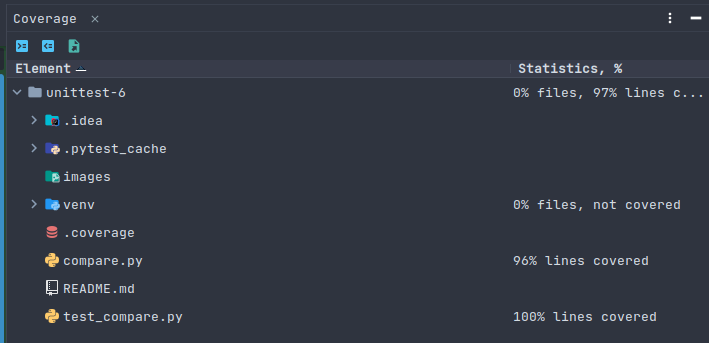
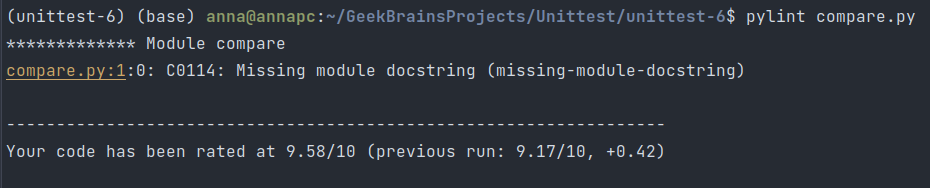
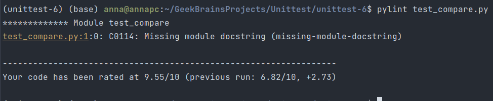

Объяснение того, какие сценарии покрыты тестами и почему вы выбрали именно эти сценарии: 
Тестирование функции get_average: 
Сценарии: 
Пустой список: Проверка, что функция возвращает 0 для пустого списка.
Непустой список: Проверка, что функция правильно вычисляет среднее значение для заданного списка. 
Почему выбраны: 
Эти сценарии проверяют базовую функциональность вычисления среднего значения списка.

Тестирование функции compare_averages: 
Сценарии: 
Равные средние значения: Проверка, что при равенстве средних значений списков возвращается соответствующее сообщение.
Первый список с большим средним: Проверка, что при большем среднем значении первого списка возвращается соответствующее сообщение.
Второй список с большим средним: Проверка, что при большем среднем значении второго списка возвращается соответствующее сообщение. 
Почему выбраны: 
Эти сценарии проверяют различные варианты сравнения средних значений двух списков.

Тестирование функции main: 
Сценарии: 
Возврат сообщения о сравнении средних значений: Проверка, что функция main возвращает правильное сообщение о сравнении средних значений. 
Почему выбран: 
Этот сценарий предоставляет дополнительное утверждение относительно корректной работы функции compare_averages.

